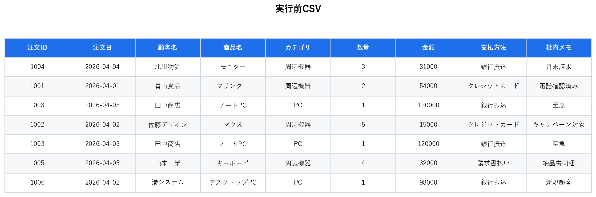
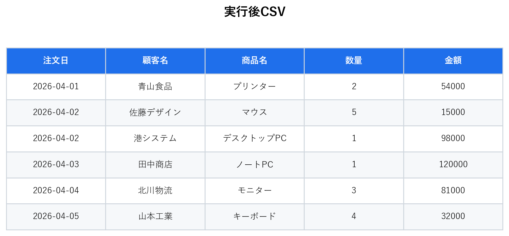

# CSV Data Cleaner

CSVデータの重複削除、列整理、並び替えを自動化するPythonツールです。売上データ、顧客リスト、商品一覧などの事務作業を効率化する目的で制作しました。

## Features

- CSVファイルを読み込み、整理済みCSVとして出力
- 完全一致する重複行を削除
- 必要な列だけを指定して出力
- 日付、金額、テキストの並び替えに対応
- 実行前後のCSVをPNG画像として出力
- pandasによるデータ処理とpytestによるテストを含む

## Files

```text
csv-data-cleaner/
├── README.md
├── requirements.txt
├── samples/
│   ├── sales_raw.csv
│   └── sales_cleaned.csv
├── docs/
│   └── images/
│       ├── before.png
│       └── after.png
├── src/
│   ├── clean_csv.py
│   ├── csv_cleaner.py
│   └── render_csv_image.py
└── tests/
    └── test_csv_cleaner.py
```

## Setup

```bash
python -m venv .venv
.venv\Scripts\activate
pip install -r requirements.txt
```

## Usage

サンプル売上データを整理します。

```bash
python src/clean_csv.py --input samples/sales_raw.csv --output samples/sales_cleaned.csv --columns "注文日,顧客名,商品名,数量,金額" --dedupe --sort-by "注文日" --sort-type date --sort-order asc
```

金額が高い順に並び替える場合:

```bash
python src/clean_csv.py --input samples/sales_raw.csv --output samples/sales_cleaned.csv --columns "注文日,顧客名,商品名,数量,金額" --dedupe --sort-by "金額" --sort-type number --sort-order desc
```

## Generate Evidence Images

```bash
python src/render_csv_image.py --input samples/sales_raw.csv --output docs/images/before.png --title "実行前CSV"
python src/render_csv_image.py --input samples/sales_cleaned.csv --output docs/images/after.png --title "実行後CSV"
```

## Before / After





## Test

```bash
pytest
```

## CLI Options

| Option | Required | Description |
| --- | --- | --- |
| `--input` | Yes | 入力CSVファイルのパス |
| `--output` | Yes | 出力CSVファイルのパス |
| `--columns` | No | 残す列名をカンマ区切りで指定 |
| `--dedupe` | No | 完全一致する重複行を削除 |
| `--sort-by` | No | 並び替え対象の列名 |
| `--sort-type` | No | `text`, `number`, `date` のいずれか |
| `--sort-order` | No | `asc` または `desc` |

## Portfolio Note

この作品は、CSV整理作業をPythonで自動化できることを示すためのポートフォリオです。README、Pythonコード、サンプルCSV、実行前後画像、テストコードを含めているため、GitHub上で成果物として確認しやすい構成にしています。
